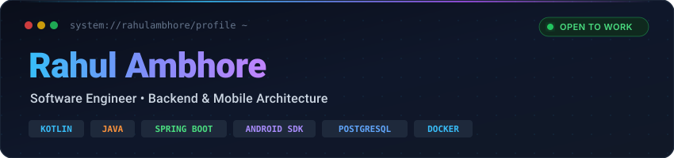

<div align="center">

  

  <br/><br/>

  [](https://git.io/typing-svg)

  <p align="center">
    <a href="https://me.rahulambhore.workers.dev/" target="_blank">
      
    </a>
    &nbsp;
    <a href="https://www.linkedin.com/in/rahul-ambhore-5102b5273/" target="_blank">
      
    </a>
    &nbsp;
    <a href="https://github.com/rahulambhore394" target="_blank">
      
    </a>
    &nbsp;
    <a href="mailto:rahulambhore394@gmail.com">
      
    </a>
  </p>

  <p align="center">
    
    &nbsp;
    
    &nbsp;
    
  </p>

</div>

---

### 💻 Developer Console

```kotlin
/**
 * ⚡ Rahul Ambhore — Software Engineer
 * Portfolio : https://me.rahulambhore.workers.dev/
 * Focus     : Backend Distributed Systems • Android Native • Agentic AI
 */
object RahulAmbhore : SoftwareEngineer() {
    const val HANDLE    = "rahulambhore394"
    const val PORTFOLIO = "https://me.rahulambhore.workers.dev/"
    
    val coreCompetencies: List<Domain> = listOf(
        Domain.BACKEND_MICROSERVICES,
        Domain.ANDROID_ARCHITECTURE,
        Domain.ENTERPRISE_IAM_RBAC,
        Domain.AGENTIC_AI_RAG
    )

    val techStack: Set<String> = setOf(
        "Kotlin", "Java", "Spring Boot", "Android SDK",
        "PostgreSQL", "Docker", "Supabase", "LangChain"
    )

    fun status(): EngineState = EngineState(
        openForRoles = true,
        mission      = "Architecting resilient microservices and high-performance Android applications."
    )
}
```

---

### 🛠️ Tech Stack & Skills

<p align="center">
  
</p>

<table width="100%">
  <thead>
    <tr>
      <th width="28%" align="left">⚡ Domain / Layer</th>
      <th width="72%" align="left">🛠️ Technologies &amp; Frameworks</th>
    </tr>
  </thead>
  <tbody>
    <tr>
      <td align="left"><b>💻 Languages &amp; Core</b></td>
      <td align="left">
        
        
        
        
        
        
      </td>
    </tr>
    <tr>
      <td align="left"><b>⚙️ Backend &amp; Architecture</b></td>
      <td align="left">
        
        
        
        
        
      </td>
    </tr>
    <tr>
      <td align="left"><b>📱 Mobile Development</b></td>
      <td align="left">
        
        
        
      </td>
    </tr>
    <tr>
      <td align="left"><b>🤖 AI &amp; Machine Learning</b></td>
      <td align="left">
        
        
        
        
      </td>
    </tr>
    <tr>
      <td align="left"><b>🔧 DevOps &amp; Tools</b></td>
      <td align="left">
        
        
        
        
      </td>
    </tr>
  </tbody>
</table>

---

### 📊 GitHub Activity & Analytics

<div align="center">

  <p align="center">
    <a href="https://github.com/ryo-ma/github-profile-trophy">
      
    </a>
  </p>

  <p align="center">
    
    
  </p>

  <p align="center">
    
  </p>

  <p align="center">
    
  </p>

</div>

---

<div align="center">

  ### 🌐 Connect With Me

  <p align="center">
    <a href="https://me.rahulambhore.workers.dev/" target="_blank">
      
    </a>
    &nbsp;&nbsp;
    <a href="https://www.linkedin.com/in/rahul-ambhore-5102b5273/" target="_blank">
      
    </a>
    &nbsp;&nbsp;
    <a href="https://github.com/rahulambhore394" target="_blank">
      
    </a>
    &nbsp;&nbsp;
    <a href="mailto:rahulambhore394@gmail.com">
      
    </a>
  </p>

  

</div>
